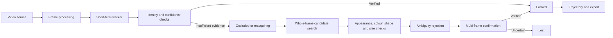

# MilitaryVision

MilitaryVision is a laptop-friendly, identity-first desktop application for
tracking one user-selected object in video.

Draw a box around any visible object and the application follows its position,
records its motion path, reports confidence, predicts briefly through occlusion,
and searches the complete frame when the short-term lock fails. Reacquisition is
deliberately conservative: an uncertain candidate is rejected instead of being
silently presented as the original target.

```text
Correct identity > temporary loss > continuous incorrect tracking
```

This repository contains the runnable MVP. It uses OpenCV and PySide6 and does
not require a GPU or downloaded neural-network weights.

## Scope and safety

MilitaryVision is a general-purpose visual tracking and movement-analysis
project for research, robotics perception, industrial inspection, sports,
wildlife observation, and video analytics.

It does not contain camera control, aiming, weapon control, firing, engagement,
or autonomous decision functionality.

## What the MVP supports

- Local MP4, MKV, AVI, MOV, and other OpenCV-readable video files
- Laptop webcams and USB cameras
- RTSP, HTTP, and IP-camera URLs supported by the installed OpenCV backend
- Mouse-drawn target selection with explicit confirmation and cancellation
- CSRT, KCF, or MIL short-term tracking
- Accurate, Balanced, and Fast CSRT performance profiles
- A persistent internal identity independent of an external tracker ID
- Appearance, colour, shape, size, motion, and visibility confidence signals
- Full-frame identity reacquisition after large or unpredictable movement
- Multi-frame verification and ambiguity rejection before relocking
- Kalman-based motion prediction during short occlusions
- Clearly different confirmed, predicted, unverified, and lost overlays
- Confirmed and predicted trajectory rendering
- Camera mirroring without corrupting target coordinates
- Processing FPS, source FPS, position, velocity, confidence, and state display
- YAML settings with validation, factory restore, import, and export
- CSV trajectory, JSON session, annotated MP4, and PNG screenshot export
- Project-local logging and generated output

The MVP does not yet include YOLO, SAM 2, neural ReID embeddings, multi-object
tracking, or GPU inference. Those components are planned as optional adapters;
the identity and state-machine rules are already separated from the underlying
tracker.

## How identity-first tracking works



The original target crop and colour profile are preserved for the full session.
Additional references are added only from sharp, in-frame, high-confidence
observations. Low-confidence, occluded, or predicted frames never update identity
memory.

When local tracking fails, the proposal stage searches a scaled copy of the
entire frame for CPU efficiency. Candidate coordinates are mapped back to the
normal processing resolution and verified against the original frame. Distance
from the last position cannot veto a strong full-frame identity match, allowing
the target to move between opposite parts of the image.

A full-frame candidate is accepted only when:

1. Appearance evidence exceeds the stronger full-frame threshold.
2. The identity score exceeds the configured match threshold.
3. The leading candidate is sufficiently better than the second candidate.
4. The same candidate remains consistent for multiple frames.

Two equally plausible objects therefore cause an uncertain or lost state rather
than an arbitrary identity switch.

## Tracking states

| Display | Meaning | Position treatment |
|---|---|---|
| `NO TARGET` | No target has been selected | No tracking overlay |
| `SELECTING` | A target box is being drawn | Selection only |
| `CONFIRMED` | The target is visible and identity checks pass | Solid confirmed overlay |
| `PREDICTED` | A short occlusion is being bridged by motion prediction | Predicted overlay only |
| `UNVERIFIED` | Whole-frame candidates are being checked | Candidate is not shown as locked |
| `NO RELIABLE LOCATION` | Identity cannot be verified | No fabricated location |

Media playback state is separate from tracking identity, so pausing a video does
not turn a confirmed target into a different tracking state.

## Requirements

- Python 3.11 or newer
- Windows 10/11 or a modern Linux distribution
- Approximately 1 GB of free space for the virtual environment and desktop
  dependencies
- A webcam only if live-camera input is required

The baseline runs entirely on CPU. An NVIDIA GPU is not required for this MVP.

## Installation

### Windows

Clone the repository and create an isolated environment:

```bat
git clone https://github.com/sillypari/MilitaryVision.git
cd MilitaryVision
py -3.11 -m venv .venv
.venv\Scripts\python.exe -m pip install --upgrade pip
.venv\Scripts\python.exe -m pip install -e ".[dev]"
```

Start the application from Command Prompt:

```bat
scripts\run.cmd
```

Or from PowerShell:

```powershell
.\scripts\run.ps1
```

The package also installs a console entry point:

```bat
.venv\Scripts\militaryvision.exe
```

### Linux

```bash
git clone https://github.com/sillypari/MilitaryVision.git
cd MilitaryVision
python3.11 -m venv .venv
.venv/bin/python -m pip install --upgrade pip
.venv/bin/python -m pip install -e ".[dev]"
.venv/bin/python -m persistent_tracker
```

Some Linux distributions require their standard Qt/XCB desktop libraries before
PySide6 applications can open a window.

## Basic workflow

1. Open a local video, camera, or compatible stream.
2. Pause on a clear frame when useful.
3. Use `Mirror: On` or `Mirror: Off` for the preferred camera orientation.
4. Select `Select target`.
5. Drag a tight rectangle around the object.
6. Select `Confirm selected box`.
7. Resume playback.
8. Watch the state, confidence, trajectory, and processing FPS.
9. Export the trajectory, session, recording, or screenshot when required.

Changing mirror mode or applying new tracking settings clears the active target
because both operations invalidate the coordinate or tracker state. Select the
target again afterward.

## Configuration

The active settings are stored in:

```text
configs/default.yaml
```

Protected factory settings are stored in:

```text
configs/factory_defaults.yaml
```

Use the in-application Settings dialog to change values. It validates related
thresholds before saving and supports reusable YAML profile import and export.

Important laptop settings:

| Setting | Default | Effect |
|---|---:|---|
| `tracking.csrt_profile` | `BALANCED` | Controls normal locked-frame CPU cost |
| `video.processing_width` | `1280` | Maximum normal processing width |
| `video.processing_height` | `720` | Maximum normal processing height |
| `reidentification.full_frame_processing_width` | `640` | Controls whole-frame proposal cost |
| `reidentification.full_frame_max_reference_templates` | `2` | Controls proposal viewpoint coverage and CPU cost |
| `reidentification.full_frame_minimum_appearance_score` | `0.82` | Rejects weak distant identity matches |
| `reidentification.ambiguity_margin` | `0.12` | Rejects scenes with similarly plausible candidates |
| `reidentification.consecutive_confirmations` | `3` | Prevents one-frame relock decisions |

Recommended tuning order:

1. Keep the CSRT profile on `BALANCED`.
2. If normal tracking is slow, reduce the video processing resolution.
3. If only reacquisition is slow, reduce the full-frame processing width to
   `480`.
4. Use `FAST` only when additional frame-rate headroom is more important than
   CSRT scale and segmentation robustness.
5. Increase identity thresholds or confirmation count when similar objects cause
   uncertain candidates.

See [Settings and templates](docs/SETTINGS.md) for all configuration behavior.

## Exports and generated files

By default, generated data stays under the project root:

```text
output/
  logs/
  recordings/
  screenshots/
  sessions/
runtime/
  pycache/
  pytest/
  pytest-cache/
models/
```

These directories, downloaded models, virtual environments, bytecode, and test
caches are excluded from Git. File dialogs can export elsewhere only when the
user explicitly chooses another location.

CSV trajectories use:

```csv
timestamp,frame,x,y,width,height,confidence,state,predicted
```

JSON sessions include the source, resolution, frame rate, active configuration,
identity metadata, trajectory, state transitions, and processing statistics.

## Testing

Run the complete suite on Windows:

```bat
scripts\test.cmd
```

Or with PowerShell:

```powershell
.\scripts\test.ps1
```

On Linux:

```bash
.venv/bin/python -m pytest
```

The suite covers:

- Candidate weighting and ambiguity rejection
- Opposite-quadrant full-frame reacquisition
- Partial appearance change during distant reacquisition
- Rejection of two equally plausible targets
- Gradual motion, rotation, scale, and lighting changes
- Confidence hysteresis and state transitions
- Identity-memory update safeguards
- Geometry, trajectory, source, UI-selection, settings, and export behavior

## Project structure

```text
MilitaryVision/
|-- configs/                    Active and factory YAML settings
|-- docs/                       Architecture, scope, plan, and settings guides
|-- models/                     Ignored local model storage
|-- output/                     Ignored logs and user exports
|-- runtime/                    Ignored caches and test artifacts
|-- scripts/                    Windows run and test entry points
|-- src/persistent_tracker/
|   |-- domain/                 Typed data models and states
|   |-- rendering/              Video overlays and trajectories
|   |-- storage/                CSV, JSON, screenshot, and video export
|   |-- tracking/               Identity, confidence, motion, and reacquisition
|   |-- ui/                     PySide6 desktop interface
|   |-- utils/                  Geometry, logging, and shared helpers
|   `-- video/                  OpenCV source handling
`-- tests/
    |-- integration/            End-to-end tracking behavior
    `-- unit/                   Deterministic component tests
```

## Known limitations

No visual-only tracker can guarantee permanent identity.

Verification may become impossible when the target remains outside the frame,
is hidden for a long period, becomes too small or blurred, changes appearance
completely, or is indistinguishable from another object during a full occlusion.
MilitaryVision reports that uncertainty instead of fabricating confidence.

The current template and colour identity model is intentionally lightweight. It
is effective for an MVP but is not equivalent to a learned general-purpose ReID
embedding model. RTSP reconnect workers, asynchronous inference, segmentation,
detector-assisted selection, and GPU acceleration remain future work.

## Roadmap

- YOLO candidate generation and detector-assisted selection
- General-purpose visual embeddings for stronger arbitrary-object ReID
- SAM 2 point, box, and mask prompts
- Camera-motion compensation and optical-flow agreement
- Dedicated capture, inference, render, recording, and export workers
- Bounded low-latency queues for live streams
- Robust RTSP reconnection
- ONNX, OpenVINO, and TensorRT adapters
- Evaluation videos with identity-switch and false-reacquisition metrics

The release-blocking failure metric remains the number of wrong-object relocks,
not merely the duration of continuous tracking.

## Documentation

- [MVP scope](docs/MVP_SCOPE.md)
- [Architecture](docs/ARCHITECTURE.md)
- [Development plan](docs/DEVELOPMENT_PLAN.md)
- [Settings and templates](docs/SETTINGS.md)

Contributions should preserve the identity-first rule, keep confirmed
observations separate from predictions, and include tests for any change to
confidence, state transitions, or reacquisition behavior.
